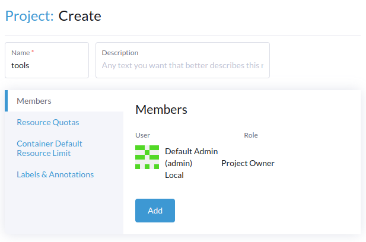
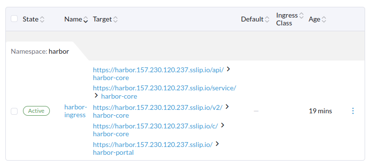
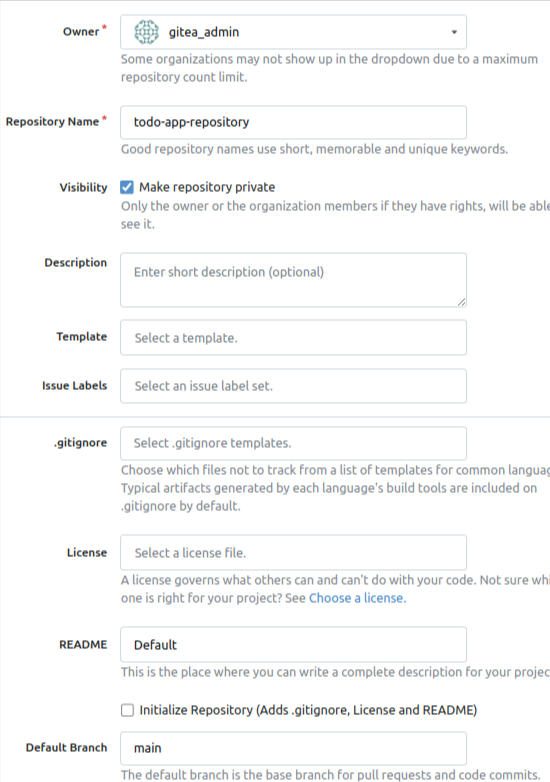
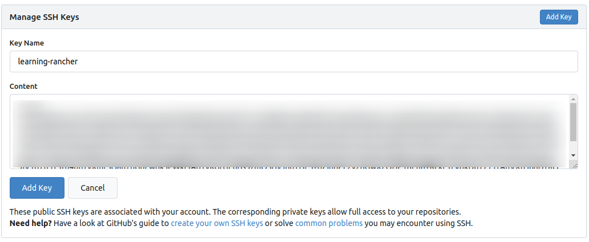

# Deploying and Managing Workloads Using Rancher Manager - Part I


## Deploying Harbor Container Registry with Rancher Manager




```bash
https://github.com/goharbor/harbor-helm/blob/1.16.0/values.yaml
```


```yaml

[...]

expose:
  type: ingress  
  ingress:
    annotations:
    className: 'traefik'    
    hosts:
      core: harbor.$WORKSPACE_PUBLIC_IP.sslip.io

[...]

externalURL: https://harbor.$WORKSPACE_PUBLIC_IP.sslip.io
harborAdminPassword: "p@ssword"

[...]

```




### Pushing our Images to Harbor


```bash
# Make sure that you created the image
docker image ls | grep todo-app || echo "The image does not exist"

# Tag the image
docker tag todo-app:latest harbor.$WORKSPACE_PUBLIC_IP.sslip.io/todo-app/todo-app:latest
```


```bash
# Download the certificate
curl -k https://harbor.$WORKSPACE_PUBLIC_IP.sslip.io/api/v2.0/systeminfo/getcert \
    -o /usr/local/share/ca-certificates/harbor.crt

# Update the CA certificates
update-ca-certificates

# Restart the Docker service
systemctl restart docker.service
```


```bash
# Make sure to adjust the password to the one you set in the `harborAdminPassword` field. 
docker login harbor.$WORKSPACE_PUBLIC_IP.sslip.io \
    -u admin \
    -p p@ssword
```


```bash
docker push harbor.$WORKSPACE_PUBLIC_IP.sslip.io/todo-app/todo-app:latest
```


## Deploying Gitea with Rancher Manager


```yaml

[...]

gitea:  
  admin:
    # Change the email address
    email: [CHANGE_ME]
    # Change the password
    password: p@ssword
    # This is the default username
    # We can keep it as is
    username: gitea_admin

[...]

image:
  repository: gitea/gitea
  # Make sure to use a static version
  # better than `latest`
  tag: '1.22.6'

[...]

ingress:  
  # Use the Traefik ingress controller (default for Rancher)
  className: traefik
  # Enable the ingress controller
  enabled: true
  hosts:
    # change $WORKSPACE_PUBLIC_IP
    - host: gitea.$WORKSPACE_PUBLIC_IP.sslip.io      

[...]

postgresql:
  # Enable standalone PostgreSQL
  enabled: true

[...]

postgresql-ha:
  # Disable PostgreSQL HA
  # We are not going to use the HA setup  
  # Use this in a production environment 
  enabled: false

[...]

redis:
  # Enable standalone Redis
  enabled: true

[...]

redis-cluster:
  # Disable Redis cluster
  # We are not going to use the HA setup 
  # Use this in a production environment
  enabled: false

[...]

service:  
  ssh:   
    # Keep it empty to create a ClusterIP service     
    # Otherwise a headless service will be created
    clusterIP: 
    # Change the port to 2222.
    port: 2222

[...]

```






```bash
# SSH into the `workspace` machine
ssh root@$WORKSPACE_PUBLIC_IP

# Export your email address
export EMAIL="[CHANGE_ME]"

# Go to the app directory
cd $HOME/todo/app

# Initialize a Git repository
git init
git config --global user.email "$EMAIL"
git config --global user.name "gitea_admin"

# Add the Git repository as a remote
git remote add origin \
  git@gitea.$WORKSPACE_PUBLIC_IP.sslip.io:gitea_admin/todo-app-repository.git

# Switch to the main branch as the default branch
git checkout -b main

# Add the files to the repository
git add .

# Commit the changes
git commit -m "Initial commit"


# Push the code to the Gitea repository
git push -u origin main
```


```bash
kubectl get svc -n gitea
```


```bash
kubectl -n gitea get svc gitea-ssh
```