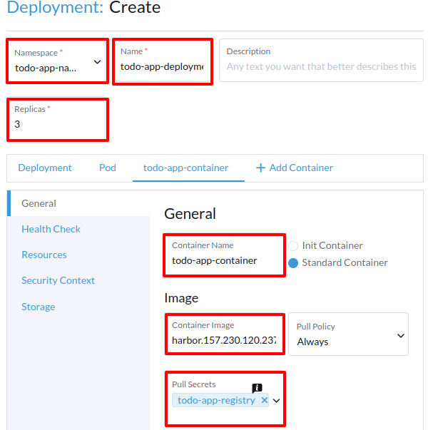
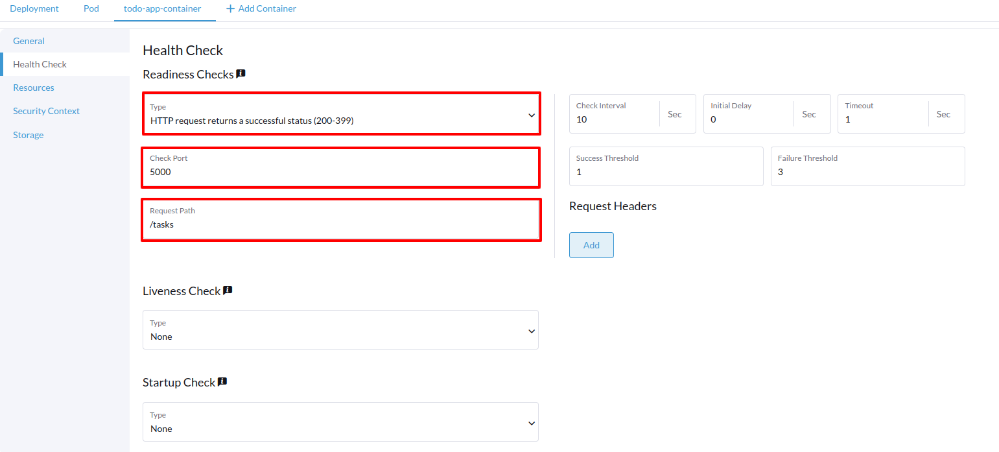
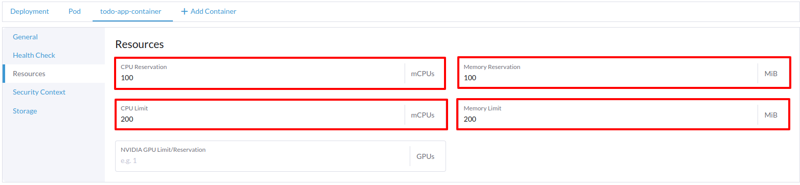
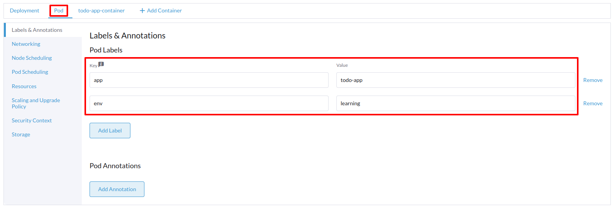
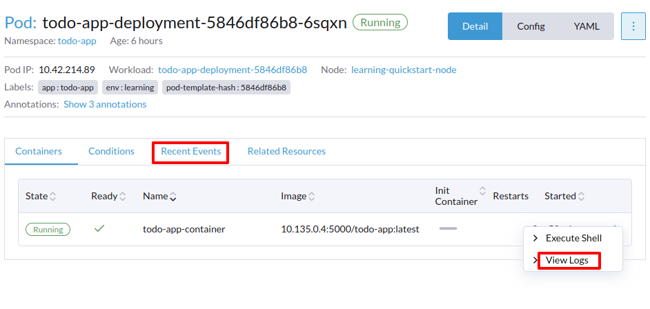

# Deploying and Managing Workloads Using Rancher Manager - Part II


## Creating a Namespace


```yaml
apiVersion: v1
kind: Namespace
metadata:
  name: todo-app
  annotations:
    field.cattle.io/containerDefaultResourceLimit: '{}'
    field.cattle.io/projectId: c-m-2zw2gtxc:p-mghcl
    #  key: string
  labels:
    field.cattle.io/projectId: p-mghcl
    #  key: string
spec:
#  finalizers:
#    - string
__clone: true
```


## Registries Secrets, Self-Signed Certificates, and Insecure Registries


```bash
harbor.157.230.120.237.sslip.io
```


```bash
# Create a list of control plane nodes
CONTROL_PLANE_NODES=$(kubectl get nodes -l node-role.kubernetes.io/control-plane -o jsonpath='{.items[*].metadata.name}')

# Add the CA certificate to the control plane nodes
for node in $CONTROL_PLANE_NODES; do
  kubectl debug node/$node -it --image=alpine -- chroot /host sh -c '
    HARBOR_HOST="[CHANGE_ME]" &&
    mkdir -p /usr/local/share/ca-certificates/$HARBOR_HOST &&
    wget --no-check-certificate -O /usr/local/share/ca-certificates/$HARBOR_HOST/ca.crt https://$HARBOR_HOST/api/v2.0/systeminfo/getcert &&
    update-ca-certificates &&
    systemctl restart rke2-server;
  ';
done

# Open a new terminal and create a list of all other nodes (worker nodes)
WORKER_NODES=$(kubectl get nodes --selector='!node-role.kubernetes.io/control-plane' -o jsonpath='{.items[*].metadata.name}')

# Add the CA certificate to the worker nodes
for node in $WORKER_NODES; do
  kubectl debug node/$node -it --image=alpine -- chroot /host sh -c '
    HARBOR_HOST="[CHANGE_ME]" &&
    mkdir -p /usr/local/share/ca-certificates/$HARBOR_HOST &&
    wget --no-check-certificate -O /usr/local/share/ca-certificates/$HARBOR_HOST/ca.crt https://$HARBOR_HOST/api/v2.0/systeminfo/getcert &&
    update-ca-certificates &&
    systemctl restart rke2-agent;
  ';
done
```


```bash
# SSH into the control plane node
ssh root@$CONTROL_PLANE_NODE_IP

# Create a directory to store the CA certificate
mkdir -p /usr/local/share/ca-certificates/harbor.$WORKSPACE_PUBLIC_IP.sslip.io

# Download the CA certificate
curl -k https://harbor.$WORKSPACE_PUBLIC_IP.sslip.io/api/v2.0/systeminfo/getcert \
    -o /usr/local/share/ca-certificates/harbor.$WORKSPACE_PUBLIC_IP.sslip.io/ca.crt

# Update the CA certificates
update-ca-certificates

# Restart the RKE2 service
sudo systemctl restart rke2-server

# Continue with the next CP and/or worker node.
# ...
# ...
```


## Creating a Deployment










## Examining and Troubleshooting Workloads




```bash
kubectl logs -n todo-app -l app=todo-app
```