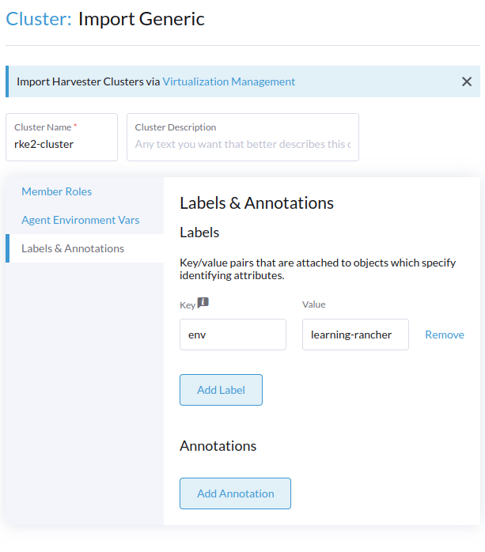
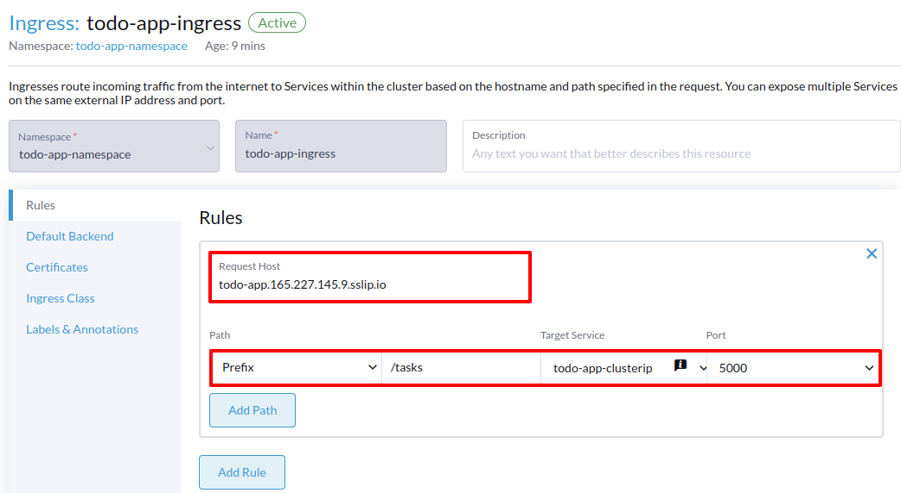

# Deploying and Managing Services Using Rancher Manager - Part I


## A ClusterIP for the Deployment


```bash
kubectl run -it --rm \
--restart=Never \
--image=busybox:1.28 \
--namespace=todo-app-namespace \
test -- \
wget -qO- http://todo-app-clusterip:5000/tasks
```


```json
{
  "tasks": []
}
```


## A NodePort for the Deployment


```bash
# Test the Controller Plane Node
curl http://$WORKLOAD_CONTROLPLANE_01_PUBLIC_IP:30000/tasks
 
# Test the Worker Plane Node (first workload node)
curl http://$WORKLOAD_NODE_01_PUBLIC_IP:30000/tasks

# Test the Worker Plane Node (load balancer machine)
curl http://$WORKLOAD_EXTLB_01_PUBLIC_IP:30000/tasks
```


```json
{
  "tasks": []
}
```


```bash
# curl: (7) Failed to connect to [...] Couldn't connect to server
curl http://$WORKLOAD_CONTROLPLANE_01_PUBLIC_IP:30000/tasks
```


## LoadBalancer Service, Cloud Providers, Bare Metal and ServiceLB (Klipper)




### ServiceLB (Klipper)


```bash
# SSH into the control plane node
ssh root@$WORKLOAD_CONTROLPLANE_01_PUBLIC_IP

# Enable the servicelb feature 
# (append to the RKE2 config file)
cat << EOF >> /etc/rancher/rke2/config.yaml
enable-servicelb: true
EOF

# Restart the RKE2 service
sudo systemctl restart rke2-server
```


```bash
kubectl get pods -n kube-system -o wide | \
  grep svclb | \
  awk '{print $7}'
```


```bash
curl http://$WORKLOAD_EXTLB_01_PUBLIC_IP:30000/tasks

# Trying the following commands will also work 
# since in this case kube-proxy will forward the traffic to the correct node
#curl http://$WORKLOAD_CONTROLPLANE_01_PUBLIC_IP:30000/tasks
#curl http://$WORKLOAD_NODE_01_PUBLIC_IP:30000/tasks
```


## Creating an Ingress Service


```bash
# SSH into the control plane node
ssh root@$WORKLOAD_CONTROLPLANE_01_PUBLIC_IP

# Check the Nginx Ingress Controller Pods
kubectl -n kube-system get pods | grep ingress-nginx-controller
```


```bash
# SSH into the external load balancer node
ssh root@$WORKLOAD_EXTLB_01_PUBLIC_IP

# Leave the RKE2 cluster
rke2-killall.sh

# Install Docker
curl https://get.docker.com | sh

# Create an Nginx configuration file
mkdir -p $HOME/nginx && cat << EOF > $HOME/nginx/nginx.conf
events {
    worker_connections 1024;  # Maximum number of simultaneous connections per worker
}

http {
    upstream backend {
        # Define the nodes IPs that are running the Ingress Controller
        server $WORKLOAD_NODE_01_PRIVATE_IP:80;

        # We can add the control plane node as well but in production,
        # we should leave handling traffic to the worker nodes
        # and use the control plane node for management purposes
        # server $WORKLOAD_CONTROLPLANE_01_PRIVATE_IP:80;
    }

    server {
        listen 80;
        listen [::]:80;

        # Listen on the public IP of the external load balancer
        server_name $WORKLOAD_EXTLB_01_PUBLIC_IP;

        location / {
            # Redirect traffic to the upstream backend (Ingress Controller)
            proxy_pass http://backend;  
            proxy_set_header Host \$host;
            proxy_set_header X-Real-IP \$remote_addr;
            proxy_set_header X-Forwarded-For \$proxy_add_x_forwarded_for;
            proxy_set_header X-Forwarded-Proto \$scheme;
        }
    }
}
EOF

# Launch the Nginx container
docker run -d --name nginx -p 80:80 -v $HOME/nginx:/etc/nginx nginx
```




```bash
wget -qO- http://todo-app.$WORKLOAD_EXTLB_01_PUBLIC_IP.sslip.io/tasks
```


```json
{
  "tasks": []
}
```