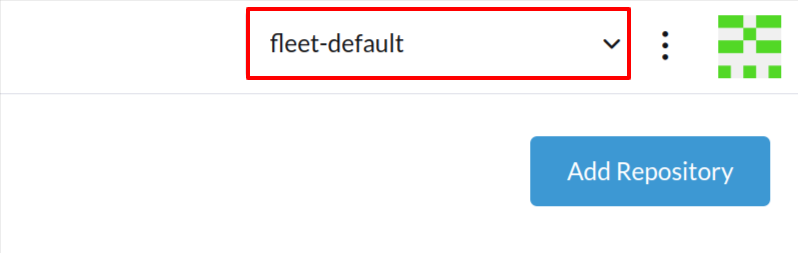
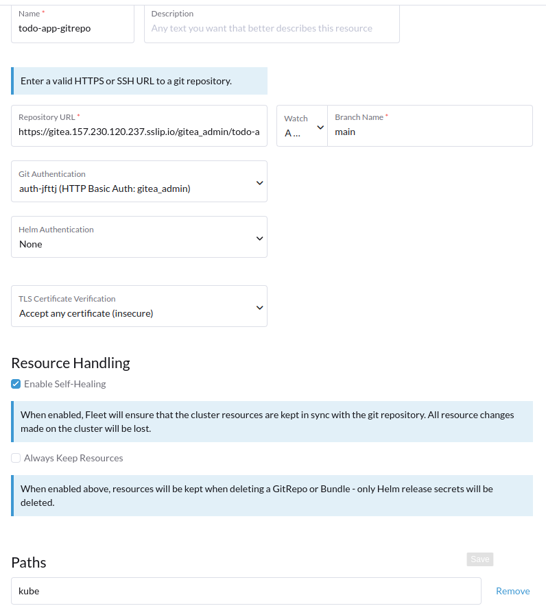

# Using Fleet for GitOps Workflows: A Practical Guide


## Deploying Applications with Fleet


### Prerequisites


```bash
#!/bin/bash

# Variables
HARBOR_URL="harbor.$WORKSPACE_PUBLIC_IP.sslip.io"
CA_CERT_PATH="/etc/ssl/certs/$HARBOR_URL/ca.crt"
REGISTRIES_YAML="/etc/rancher/rke2/registries.yaml"
HARBOR_USER="admin"
HARBOR_PASSWORD="p@ssword"

# Define control plane and worker nodes
CONTROL_PLANE_NODES=(
  "$WORKLOAD_CONTROLPLANE_01_PUBLIC_IP"
  # Add more control plane IPs here if needed
)

WORKER_NODES=(
  "$WORKLOAD_NODE_01_PUBLIC_IP"
  # Add more worker IPs here if needed
)

# Function to configure a node
configure_node() {
  local node_ip=$1
  local service=$2

  ssh root@$node_ip << EOF
    mkdir -p "/etc/ssl/certs/$HARBOR_URL"
    curl -kL "https://$HARBOR_URL/api/v2.0/systeminfo/getcert" -o "$CA_CERT_PATH"
    update-ca-certificates
    cat << EOT > "$REGISTRIES_YAML"
configs:
  $HARBOR_URL:
    auth:
      username: $HARBOR_USER
      password: $HARBOR_PASSWORD
    tls:
      ca_file: $CA_CERT_PATH
EOT
    systemctl restart $service
EOF
}

# Configure control plane nodes
echo "Configuring control plane nodes..."
for node in "${CONTROL_PLANE_NODES[@]}"; do
  echo "Configuring control plane node: $node"
  configure_node "$node" "rke2-server"
done

# Configure worker nodes
echo "Configuring worker nodes..."
for node in "${WORKER_NODES[@]}"; do
  echo "Configuring worker node: $node"
  configure_node "$node" "rke2-agent"
done

echo "Configuration completed."
```


```bash
# SSH into the RKE2 CP
ssh root@$WORKLOAD_CONTROLPLANE_01_PUBLIC_IP

# Get storage classes
kubectl get storageclass

# ==> output: No resources found
```


```bash
# SSH into the RKE2 CP
ssh root@$WORKLOAD_CONTROLPLANE_01_PUBLIC_IP

# Add the Rancher Local Path Provisioner
git clone https://github.com/rancher/local-path-provisioner.git
cd local-path-provisioner

# Checkout the version 0.0.30
git checkout v0.0.30

# Deploy the Local Path Provisioner
kubectl apply -f deploy/local-path-storage.yaml

# Clean up
cd ..
rm -rf local-path-provisioner

# Check the storage classes
kubectl get sc
```


```bash
# Create a folder:
mkdir -p $HOME/todo/app/kube
```


```bash
# Create a secret for the registry:
USERNAME=admin
PASSWORD=p@ssword

# Create a Docker registry secret
DOCKER_CONFIG_JSON=$(echo -n "{\"auths\":{\"harbor.$WORKSPACE_PUBLIC_IP.sslip.io\":{\"username\":\"$USERNAME\",\"password\":\"$PASSWORD\",\"auth\":\"$(echo -n $USERNAME:$PASSWORD | base64)\"}}}" | base64 | tr -d '\n')
```


```bash
cat << EOF > $HOME/todo/app/kube/todo-app-manifests.yaml
---
apiVersion: v1
kind: Secret
type: kubernetes.io/dockerconfigjson
metadata:
  name: todo-app-registry
  namespace: todo-app-namespace
data:
  .dockerconfigjson: $DOCKER_CONFIG_JSON
EOF
```


```bash
cat << EOF >> $HOME/todo/app/kube/todo-app-manifests.yaml
---
kind: PersistentVolumeClaim
apiVersion: v1
metadata:
  name: todo-app-data
  namespace: todo-app-namespace
spec:
  accessModes:
    - ReadWriteOnce
  resources:
    requests:
      storage: 1Gi 
  storageClassName: local-path   
EOF
```


```bash
cat << EOF >> $HOME/todo/app/kube/todo-app-manifests.yaml
---
apiVersion: apps/v1
kind: Deployment
metadata:
  name: todo-app
  namespace: todo-app-namespace
spec:
  replicas: 1
  selector:
    matchLabels:
      app: todo-app
  template:
    metadata:
      labels:
        app: todo-app
    spec:
      # Only run the pod on the worker node
      nodeSelector:
        kubernetes.io/hostname: "rke2-node-01"
      containers:
      - name: todo-app
        image: harbor.$WORKSPACE_PUBLIC_IP.sslip.io/todo-app/todo-app:latest
        imagePullPolicy: Always
        ports:
        - containerPort: 5000
        volumeMounts:
        - name: todo-app-data
          mountPath: /var/data/todo-app
      imagePullSecrets:
      - name: todo-app-registry 
      volumes:
      - name: todo-app-data
        persistentVolumeClaim:
          claimName: todo-app-data
EOF
```


```bash
cat << EOF >> $HOME/todo/app/kube/todo-app-manifests.yaml
---
apiVersion: v1
kind: Service
metadata:
  name: todo-app-clusterip
  namespace: todo-app-namespace
spec:
  selector:
    app: todo-app
  ports:
    - protocol: TCP
      port: 5000
      targetPort: 5000
  type: ClusterIP
EOF
```


```bash
cat << EOF >> $HOME/todo/app/kube/todo-app-manifests.yaml
---
# Nginx Ingress definition
apiVersion: networking.k8s.io/v1
kind: Ingress
metadata:
  name: todo-app-ingress
  namespace: todo-app-namespace
  annotations:
    nginx.ingress.kubernetes.io/rewrite-target: /
spec:
  rules:
  - host: todo-app.$WORKLOAD_EXTLB_01_PUBLIC_IP.sslip.io
    http:
      paths:
        - path: /
          pathType: Prefix
          backend:
            service:
              name: todo-app-clusterip
              port:
                number: 5000
EOF
```


```bash
cd $HOME/todo/app
git add .
git commit -m "Add the Kubernetes manifests for the Todo App"
git push origin main
```


### Creating a Fleet GitRepo






```bash
# SSH into the RKE2 CP
ssh root@$WORKLOAD_CONTROLPLANE_01_PUBLIC_IP
# Scale the deployment to 2 replicas 
# and watch the changes reverting back to 1
kubectl -n todo-app-namespace scale deployment \
  todo-app --replicas=2
```


### Using YAML Files to Create a Fleet GitRepo


```bash
# Delete the GitRepo
kubectl -n fleet-default delete gitrepo todo-app-gitrepo
```


```yaml
cat << EOF > $HOME/todo/app/todo-app-gitrepo.yaml
---
apiVersion: v1
kind: Secret
metadata:  
  name: gitea-auth
  namespace: fleet-default
type: kubernetes.io/basic-auth
data:
  password: cEBzc3dvcmQ=
  username: Z2l0ZWFfYWRtaW4=
EOF
```


```yaml
cat << EOF >> $HOME/todo/app/todo-app-gitrepo.yaml
---
apiVersion: fleet.cattle.io/v1alpha1
kind: GitRepo
metadata:
  name: todo-app-gitrepo
  namespace: fleet-default  
spec:
  targets:
    - clusterName: rke2-cluster    
  repo: https://gitea.$WORKSPACE_PUBLIC_IP.sslip.io/gitea_admin/todo-app-repository
  branch: main    
  paths:
    - kube  
  targetNamespace: todo-app-namespace
  correctDrift:
    enabled: true    
  insecureSkipTLSVerify: true  
  clientSecretName: gitea-auth
EOF
```


```bash
kubectl apply -f $HOME/todo/app/todo-app-gitrepo.yaml
```