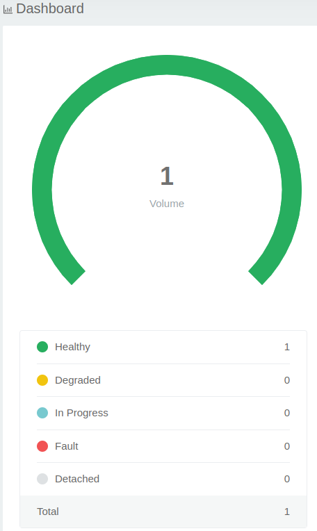
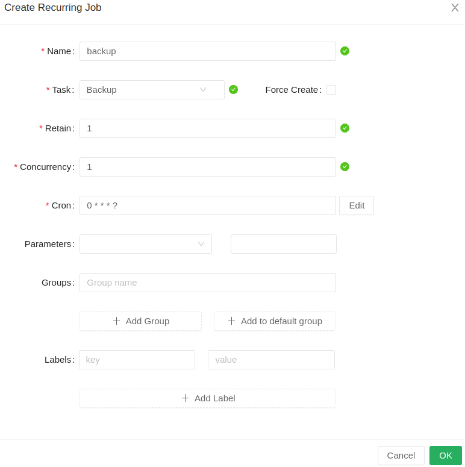
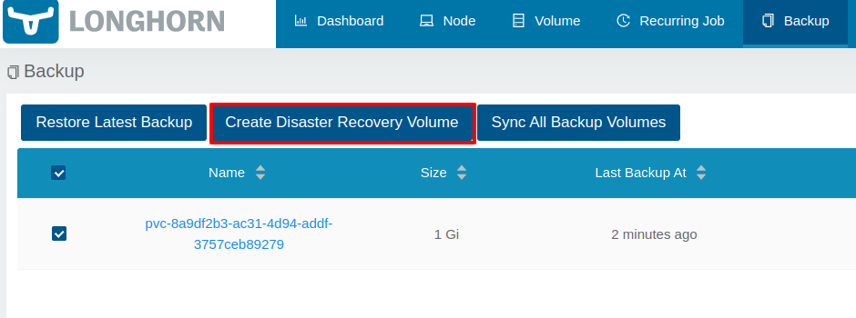

# Longhorn: Understanding How It Works with Practical Examples


## Using Longhorn Storage Class


```bash
# SSH into the RKE2 CP
ssh root@$WORKLOAD_CONTROLPLANE_01_PUBLIC_IP

# List the storage classes
kubectl get sc
```


```bash
# SSH into the workspace server
ssh root@$WORKSPACE_PUBLIC_IP

# Update ``local-path`` to ``longhorn`` in the application manifest
sed -i 's/storageClassName: local-path/storageClassName: longhorn/' \
  $HOME/todo/app/kube/todo-app-manifests.yaml

# Git commit and push the changes
cd $HOME/todo/app
git add .
git commit -m "Use Longhorn storage class"
git push origin main
```


```bash
# SSH into the RKE2 CP
ssh root@$WORKLOAD_CONTROLPLANE_01_PUBLIC_IP

# Delete the old application
kubectl delete ns todo-app-namespace
```




## Core Components: Longhorn Manager and Engine


```bash
# SSH into the RKE2 CP
ssh root@$WORKLOAD_CONTROLPLANE_01_PUBLIC_IP

# List the Persistent Volumes
kubectl -n longhorn-system get volumes.longhorn.io
```


```bash
# List the Longhorn Manager pods
kubectl -n longhorn-system get pods \
    -l app=longhorn-manager
```


```bash
# List the Longhorn Engine pods
kubectl -n longhorn-system get pods \
    -l longhorn.io/component=engine-image
```


## Data Reliability with Replication


```bash
# List the Longhorn replicas
kubectl -n longhorn-system get replicas.longhorn.io 
```


## Snapshots and Backups


```bash
pip install awscli --break-system-packages
```


```bash
export AWS_ACCESS_KEY_ID=[YOUR_ACCESS_KEY_ID]
export AWS_SECRET_ACCESS_KEY=[YOUR_SECRET
```


```bash
export AWS_REGION=eu-west-3
export BUCKET_NAME=longhorn-backups-$(date +%s)

aws s3api create-bucket \
    --bucket $BUCKET_NAME \
    --region $AWS_REGION \
    --create-bucket-configuration LocationConstraint=$AWS_REGION \
    --acl private
```


```bash
cat <<EOF > /tmp/longhorn-s3-policy.json
{
  "Version": "2012-10-17",
  "Statement": [
    {
      "Sid": "GrantLonghornBackupstoreAccess0",
      "Effect": "Allow",
      "Action": [
        "s3:PutObject",
        "s3:GetObject",
        "s3:ListBucket",
        "s3:DeleteObject"
      ],
      "Resource": [
        "arn:aws:s3:::$BUCKET_NAME",
        "arn:aws:s3:::$BUCKET_NAME/*"
      ]
    }
  ]
}
EOF
```


```bash
POLICY_ARN=$(aws iam create-policy \
    --policy-name MyLonghornBackupPolicy \
    --policy-document file:///tmp/longhorn-s3-policy.json \
    --query Policy.Arn \
    --output text)
```


```bash
aws iam create-user --user-name longhorn-backup-user
```


```bash
aws iam attach-user-policy \
    --policy-arn $POLICY_ARN \
    --user-name longhorn-backup-user
```


```bash
ACCESS_KEYS=$(aws iam create-access-key --user-name longhorn-backup-user --query 'AccessKey.{AccessKeyId:AccessKeyId,SecretAccessKey:SecretAccessKey}' --output json)
export AWS_ACCESS_KEY_ID=$(echo $ACCESS_KEYS | jq -r '.AccessKeyId')
export AWS_SECRET_ACCESS_KEY=$(echo $ACCESS_KEYS | jq -r '.SecretAccessKey')
```


```bash
echo "kubectl -n longhorn-system create secret generic longhorn-backup-secret \
--from-literal=AWS_ACCESS_KEY_ID=$AWS_ACCESS_KEY_ID \
--from-literal=AWS_SECRET_ACCESS_KEY=$AWS_SECRET_ACCESS_KEY
"
```




```bash
aws s3 ls \
  s3://$BUCKET_NAME/backup/backupstore/volumes/
```


## Disaster Recovery Volumes




## ReadWriteMany Volumes and NFSv4


```yaml

[...]

---
kind: PersistentVolumeClaim
apiVersion: v1
metadata:
  name: todo-app-data
  namespace: todo-app-namespace
spec:
  accessModes:
    # This is the access mode
    - ReadWriteOnce 
  resources:
    requests:
      storage: 1Gi
  storageClassName: longhorn

[...]

```


```bash
# SSH into the workspace server
ssh root@$WORKSPACE_PUBLIC_IP

# Update the application manifest to use the ReadWriteMany access mode
sed -i 's/ReadWriteOnce/ReadWriteMany/' \
  $HOME/todo/app/kube/todo-app-manifests.yaml

# Set the replica count to 3
sed -i 's/replicas:.*/replicas: 3/' \
  $HOME/todo/app/kube/todo-app-manifests.yaml

# Git commit and push the changes
cd $HOME/todo/app
git add .
git commit -m "Use ReadWriteMany access mode"
git push origin main
```


```bash
# SSH into the RKE2 CP
ssh root@$WORKLOAD_CONTROLPLANE_01_PUBLIC_IP
# Delete the PVC
kubectl delete pvc todo-app-data -n todo-app-namespace
# Delete the pod that holds the PVC
kubectl delete pod [POD_NAME] -n todo-app-namespace --force --grace-period=0
# Copy the name of the PVC and run the following command
kubectl patch pvc [PVC_NAME] -n todo-app-namespace -p '{"metadata":{"finalizers":null}}'
```


```bash
# SSH into the RKE2 CP
ssh root@$WORKLOAD_CONTROLPLANE_01_PUBLIC_IP

# Get the PV name
PV_NAME=$(kubectl -n todo-app-namespace get pvc todo-app-data -o jsonpath='{.spec.volumeName}')

# List the NFS services (service has the same name as the volume)
kubectl -n longhorn-system get svc \
  -l longhorn.io/share-manager=$PV_NAME

# List the share-manager pod
kubectl -n longhorn-system get pods \
  -l longhorn.io/share-manager=$PV_NAME
```


```yaml
kind: StorageClass
apiVersion: storage.k8s.io/v1
metadata:
  name: longhorn-rwx
provisioner: driver.longhorn.io
parameters:
  nfsOptions: "vers=4.2,noresvport,softerr,timeo=600,retrans=5"
  numberOfReplicas: "3"
  staleReplicaTimeout: "2880"
allowVolumeExpansion: true
reclaimPolicy: Delete
volumeBindingMode: Immediate
```


```bash
# SSH into the RKE2 CP
ssh root@$WORKLOAD_CONTROLPLANE_01_PUBLIC_IP

# Add the Bitnami repository
helm repo add bitnami https://charts.bitnami.com/bitnami

# Install the WordPress Helm chart
helm upgrade --install my-wordpress bitnami/wordpress \
  --version 24.1.5 \
  --namespace my-wordpress \
  --create-namespace \
  --set mariadb.architecture=replication \
  --set replicaCount=2 \
  --set ingress.enabled=true \
  --set ingress.ingressClassName=nginx \
  --set ingress.hostname=wordpress.$WORKLOAD_NODE_01_PUBLIC_IP.sslip.io

# to uninstall: helm uninstall my-wordpress -n wordpress
```


## What's Next?