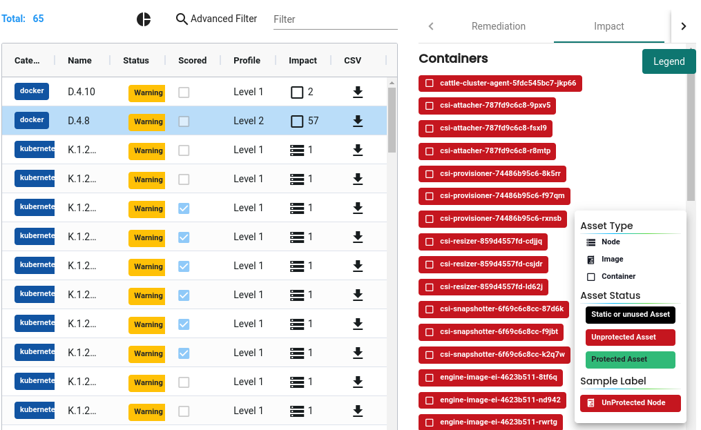
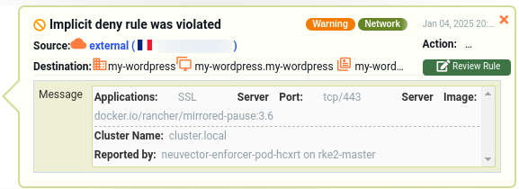
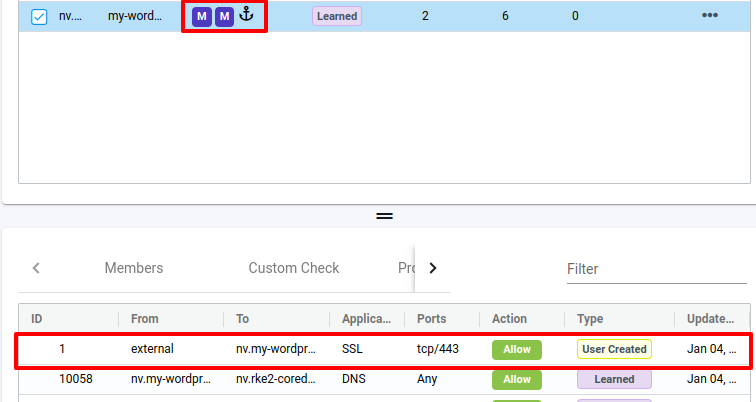
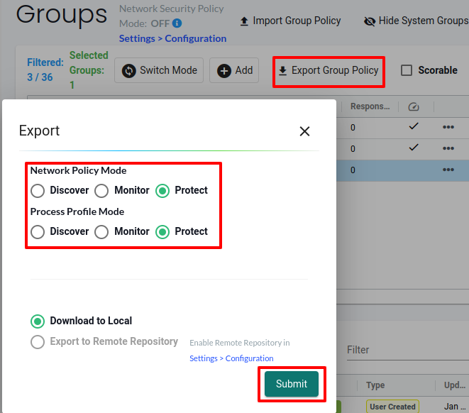
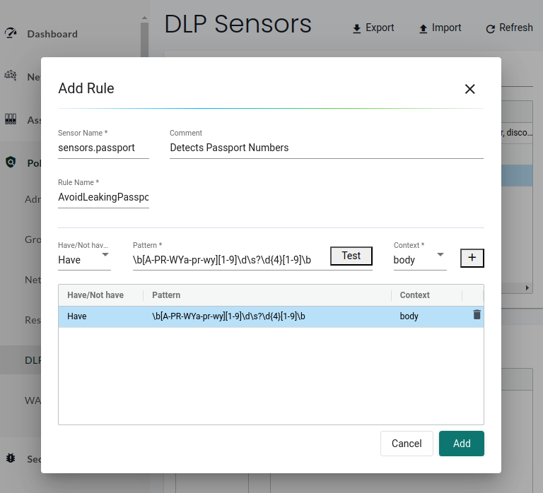
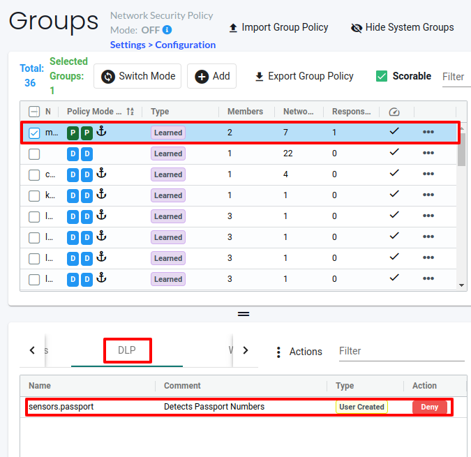
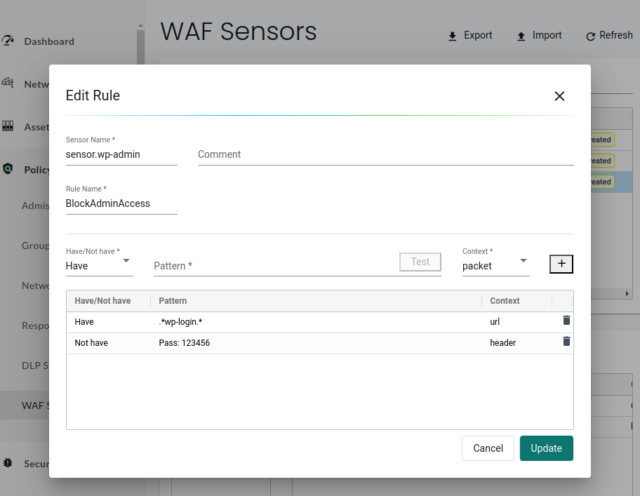
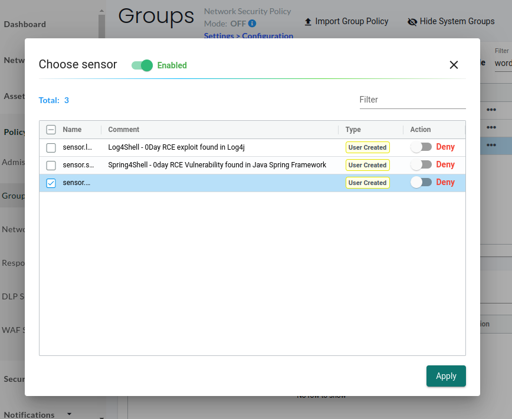
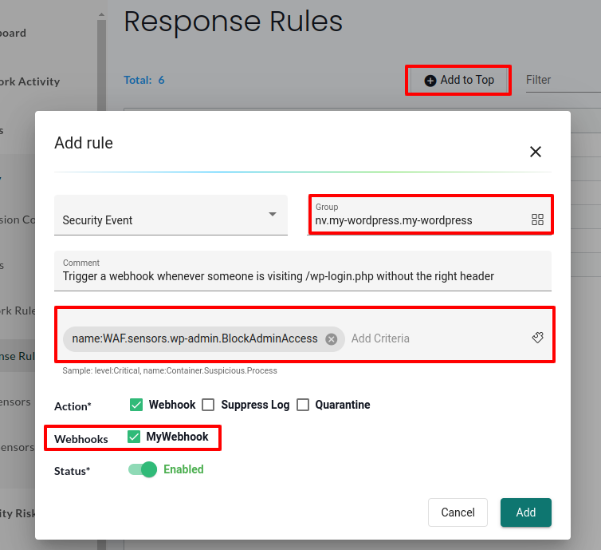

# NeuVector: Automating and Shifting Security Left in Kubernetes


## Installing NeuVector


## Compliance and Auditing




## Vulnerability Management


## The Network Activity Dashboard


## Groups and Policies: Discover, Monitor, Protect






## Security Policy as Code (SPaC): Shifting Security Left with NeuVector




```yaml
# Define the API version and the type of resource
apiVersion: neuvector.com/v1
kind: NvSecurityRule

# Metadata about the security rule
metadata:
  # Name of the security rule
  name: nv.my-wordpress          
  # Kubernetes namespace where the rule is applied
  namespace: my-wordpress        

spec:
  # Enable Data Loss Prevention (DLP) features
  dlp:
    status: true
  # Enable Web Application Firewall (WAF) features
  waf:
    status: true    

  # Define outbound (egress) network traffic rules
  egress:
    # Allow outgoing DNS traffic
    - action: allow               
      applications: [DNS]
      name: allow-dns
      ports: any
      selector:
        criteria:
          - key: service
            op: =
            # Match the CoreDNS service
            value: rke2-coredns    

  # Define inbound (ingress) network traffic rules
  ingress:
    # Allow incoming SSL traffic on port 443
    - action: allow               
      applications: [SSL]
      name: allow-ssl
      ports: tcp/443
      selector:
        # Apply to external sources
        name: external             

    # Allow incoming HTTP traffic from nodes
    - action: allow               
      applications: [HTTP]
      name: allow-http
      ports: any
      selector:
        # Apply to internal cluster nodes
        name: nodes                

  # Specify allowed processes within the containers
  process:
    # Allow the bash shell
    - action: allow               
      name: bash
      path: /usr/bin/bash

    # Allow the PHP interpreter
    - action: allow               
      name: php
      path: /opt/bitnami/php/bin/php

  # Define the process protection profile
  process_profile:
    # Strict baseline with no deviations
    baseline: zero-drift           
    # Actively block unauthorized processes
    mode: Protect

  # Target settings for policy enforcement
  target:
    # Enforce policies in Protect mode
    policymode: Protect            
    selector:
      criteria:
        - key: service
          op: =
          # Apply policy to the 'my-wordpress' service
          value: my-wordpress      
```


## DLP Sensors: Protecting Sensitive Data


```yaml
[...]

spec:
  # Enable Data Loss Prevention (DLP) features
  dlp:
    status: true

[...]
```


```bash
\b(?!\b(\d)\1+-?(\d)\1+-?(\d)\1+\b)(?!123-?45-?6789|219-?09-?9999|078-?05-?1120)(?!666|000|9\d{2})\d{3}-?(?!00)\d{2}-?(?!0{4})\d{4}\b
```


```bash
\b[A-PR-WYa-pr-wy][1-9]\d\s?\d{4}[1-9]\b
```






## WAF: Web Application Firewall






```bash
# This request should not be blocked
while true; do curl -ILkv -H "Pass: 123456"  \
  http://wordpress.167.99.244.81.sslip.io/wp-login.php; sleep 2; done;

# This request should be blocked
while true; do curl -ILkv -H "Pass: 654321"  \
  http://wordpress.167.99.244.81.sslip.io/wp-login.php; sleep 2; done;
```


## Response Rules: Active Defense


```bash
ngrok http 3000
```





```python
# Import necessary modules from Flask
from flask import Flask, request

# Initialize the Flask application
app = Flask(__name__)

# Define a route that catches all paths and methods
@app.route('/', defaults={'path': ''}, methods=['GET', 'POST', 'PUT', 'DELETE', 'PATCH'])
@app.route('/<path:path>', methods=['GET', 'POST', 'PUT', 'DELETE', 'PATCH'])
def catch_all(path):
    # Print the HTTP method used
    print(f"Method: {request.method}")

    # Print the requested path
    print(f"Path: /{path}")

    # Print all request headers
    print(f"Headers: {dict(request.headers)}")

    # Print the request body
    print(f"Body: {request.get_data()}")

    # Respond to the client
    return "Request received", 200

# Run the Flask app on all available IPs on port 300
if __name__ == '__main__':
    app.run(host='0.0.0.0', port=3000)
```


```json
{
  "level": "CRITICAL",
  "cluster": "cluster.local",
  "comment": "Trigger a webhook whenever someone is visiting /wp-login.php without the right header",
  "name": "WAF.sensors.wp-admin.BlockAdminAccess",
  "level": "Critical",
  "cluster_name": "cluster.local",
  "response_rule_id": 8,
  "host_id": "rke2-master:f2041650-b334-45c2-9575-f3a42d0e6858",
  "host_name": "rke2-master",
  "enforcer_id": "704a4ec457d456456194fcc31ca324eae017c21da4ae034875adcfade5c544e9",
  "enforcer_name": "neuvector-enforcer-pod-hcxrt",
  "threat_id": 40003,
  "client_workload_id": "XXX.XXX.XXX.XXX",
  "client_workload_name": "XXX.XXX.XXX.XXX",
  "server_workload_name": "my-wordpress-6769ff64bd-297mb",
  "server_workload_domain": "my-wordpress",
  "severity": "Critical",
  "action": "deny",
  "count": 1,
  "client_ip": "XXX.XXX.XXX.XXX",
  "server_ip": "XXX.XXX.XXX.XXX",
  "sensor": "sensors.wp-admin",
  "group": "nv.my-wordpress.my-wordpress",
  "target": "server",
  "message": "WAF: id 40003"
  [...]
  [...]
}
```


## What's Next?