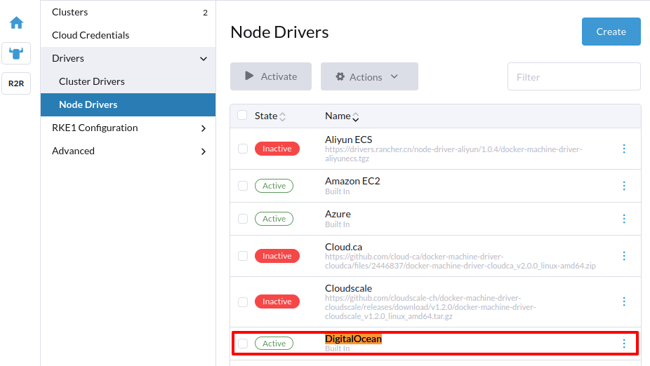
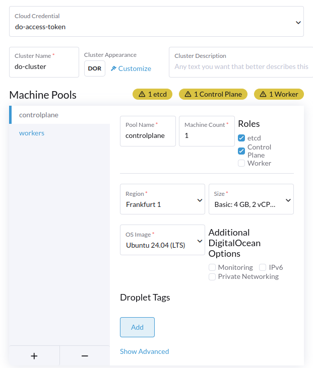

# Cluster Management in Rancher: Expanding Possibilities

## Imported Clusters (Non-RKE2 Self-Hosted Clusters)

## Rancher-Launched Clusters (RKE2 Self-Hosted Clusters)

## Cloud-Managed Clusters

## A Comparison of Features for Different Cluster Types

## Creating a Rancher-launched Cluster

