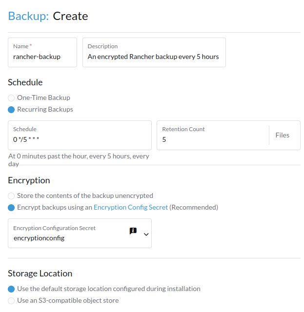
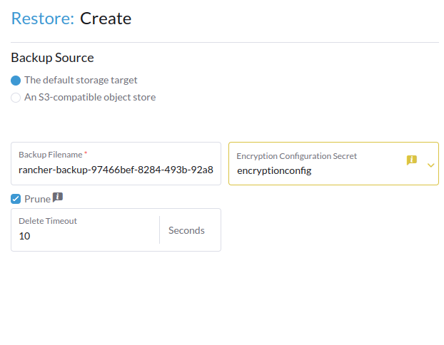

# Disaster Recovery: Best Practices and Procedures


## What is a Snapshot?


```bash
# SSH to an etcd node and run the following command
ls -l /var/lib/rancher/rke2/server/db/snapshots/
```


## Best Practices for Cluster Backup and Restore


### Automated Backups


### Offsite Storage


### Backup the Management Cluster


```bash
BASE64_ENCODED_KEY=$(head -c 32 /dev/urandom | base64)
```


```yaml
cat <<EOF > encryption-provider-config.yaml
apiVersion: apiserver.config.k8s.io/v1
kind: EncryptionConfiguration
resources:
  - resources:
      - secrets
      - configmaps
    providers:
      - aescbc:
          keys:
            - name: key1
              secret: ${BASE64_ENCODED_KEY}
      - identity: {}
EOF
```


```bash
kubectl create secret generic encryptionconfig \
  --from-file=./encryption-provider-config.yaml \
  -n cattle-resources-system
```




```bash
/var/lib/rancher/k3s/storage/
```

