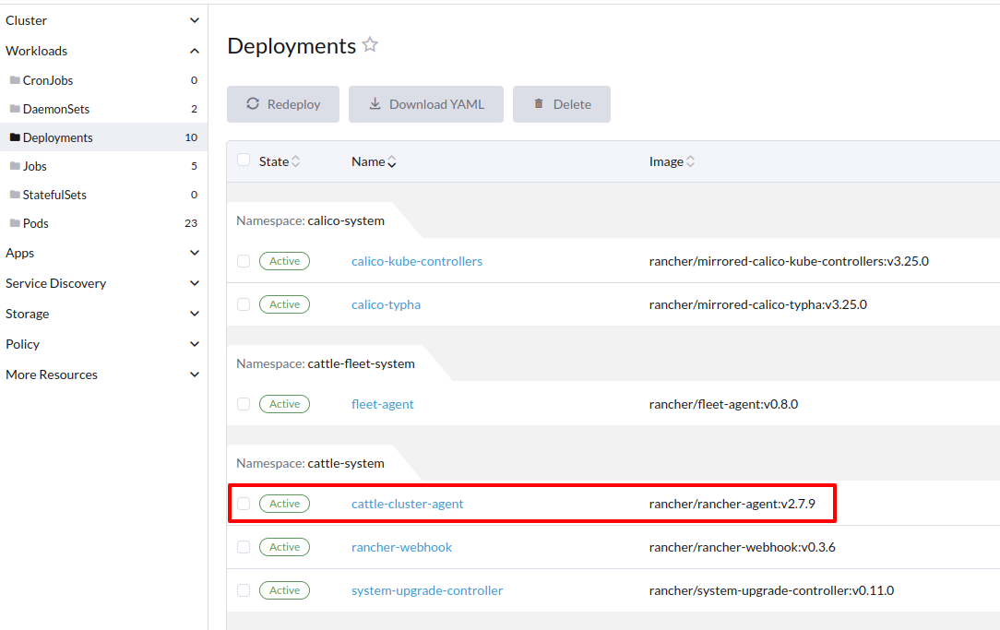

# Rancher Agents: Cattle Cluster Agent, Cattle Node Agent, Rancher System Agent


### Cluster Agent


```yaml
apiVersion: apps/v1
kind: Deployment
metadata:
  name: cattle-cluster-agent
  namespace: cattle-system
spec:
  selector:
    matchLabels:
      app: cattle-cluster-agent
  template:
    metadata:
      labels:
        app: cattle-cluster-agent
    spec:
      containers:
        - name: cluster-register
          image: rancher/rancher-agent:v2.7.9
          env:
          - name: CATTLE_SERVER
            value: "https://rancher.138.68.110.217.sslip.io"
          - name: CATTLE_CLUSTER
            value: "true"
[...]
[...]            
```




### Node Agent


### System Agent


```bash
ps aux | grep rancher-system-agent
```