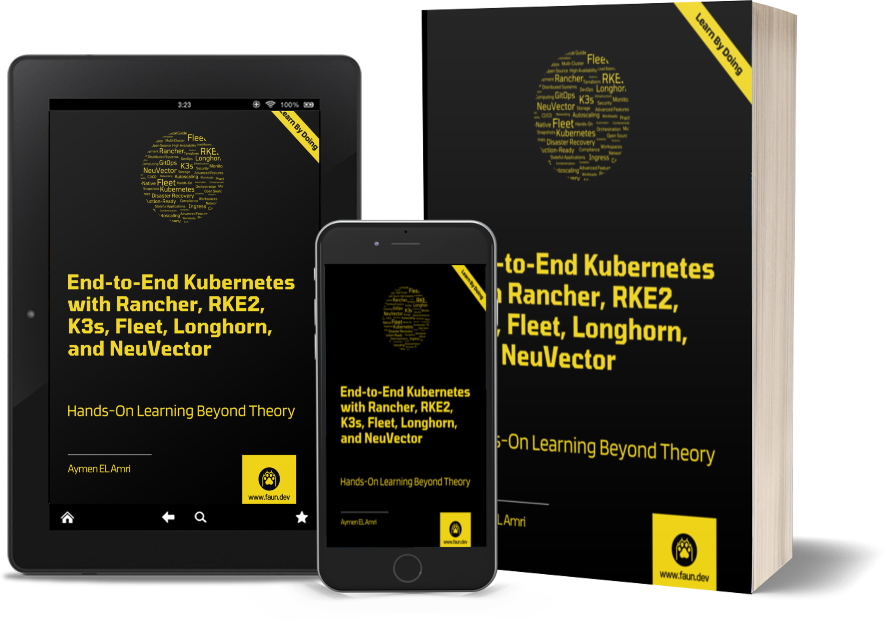

# End-to-End Kubernetes with Rancher, RKE2, K3s, Fleet, Longhorn, and NeuVector - The Companion Toolkit

This repository contains the code snippets used in *End-to-End Kubernetes with Rancher, RKE2, K3s, Fleet, Longhorn, and NeuVector*. 

## Who This Guide is For

This guide is suitable for anyone invested and interested in managing, securing, scaling, and automating Kubernetes clusters and deployments using Rancher Manager, Fleet, NeuVector (SUSE Security), Longhorn, and other SUSE/Rancher products. It is designed for developers, DevOps engineers, SREs, and IT professionals who want to have not just a theoretical understanding of Rancher Manager and its ecosystem, but also a practical, hands-on experience following real-world examples.

A basic understanding of Kubernetes and containerization is recommended, but not strictly required as some—not all—basic concepts will be covered in the guide. If you are new to Kubernetes, I recommend having at least the necessary knowledge and understanding of the core concepts of Kubernetes, such as Pods, Deployments, Services, and Namespaces.

No prior experience with the products and tools mentioned above is required, as this guide will cover everything you need to know to get started and become quickly proficient with the ecosystem of SUSE Rancher and its extensions. Kubernetes today is not just a technology used by system administrators or DevOps engineers, but also by developers, architects, network engineers, and all IT professionals who use containers in their daily work. This guide is designed to be accessible to all these roles.

## What You Will Learn

Rancher and SUSE offer a powerful suite of tools to simplify Kubernetes management and help you fully realize the potential of containerized applications. However, not all users are aware of the full range of features and capabilities provided by this dynamic ecosystem. Online documentation can be overwhelming, sometimes outdated, and often lacks real-world and practical implementation examples. Filling this gap is the primary goal of this guide.

This guide provides clear, practical steps to deploy, secure, and scale Kubernetes environments, from lightweight edge clusters with K3s to robust workloads with RKE2. You’ll explore tools like Rancher Manager, Fleet for GitOps, and NeuVector for security and gain the skills needed to address real-world challenges. Designed to resonate with Kubernetes users of all levels, this guide will help you leverage this ecosystem confidently. To achieve this goal, here are some of the key topics you will go through:

- **Core Kubernetes and Rancher Concepts**: Build a strong foundation in Kubernetes, including containerized applications, and understand the evolution of Rancher Kubernetes distributions (RKE, RKE2, K3s) tuned for various use cases such as edge computing, IoT, and high-security environments.

- **RKE2 and K3s Deployments**: Explore the key improvements in RKE2, including containerd adoption, advanced security features, and compliance capabilities. Learn to deploy single-node and multi-node clusters using RKE2 and K3s for scalable and secure infrastructures.

- **Rancher Deployment Strategies**: Evaluate centralized and decentralized deployment strategies for Rancher Manager. Explore hub-and-spoke and regional architectures, understanding their trade-offs, benefits, and best-use scenarios.

- **Drivers and Agents in Rancher**: Gain insights into Rancher’s built-in cluster and node drivers for platforms like AWS, Google Cloud, and DigitalOcean. Understand the roles of Rancher agents, including Cattle Cluster Agent, Cattle Node Agent, and Rancher System Agent, in automating cluster operations and enabling advanced features.

- **Cluster Management in Rancher**: Master centralized cluster management using Rancher Manager to orchestrate diverse environments. Understand the differences between imported, Rancher-launched, and cloud-managed clusters, and learn to integrate them into a unified platform.

- **Service and Workload Management**: Deploy and manage Kubernetes applications and services using Rancher Manager. Leverage namespaces, deployments, health checks, Kubernetes services, and advanced networking features like network policies and LoadBalancer services.

- **Scaling and Autoscaling**: Learn to optimize application performance and scalability using Kubernetes autoscalers. Configure and use Rancher Autoscaler for dynamic cluster scaling, and explore its integration with Horizontal and Vertical Pod Autoscalers.

- **Disaster Recovery and Backup**: Master disaster recovery techniques using Rancher snapshots and automated backups. Explore strategies for integrating S3-compatible storage, encrypted backups, and restoring clusters effectively in failure scenarios.

- **Rancher Extensions and UI Customization**: Enhance and customize the Rancher experience with built-in and external extensions. Learn to install, use, and build extensions to extend Rancher’s functionality.

- **GitOps and Fleet Management**: Understand the principles of GitOps and Fleet’s role in automating Kubernetes deployments. Organize clusters and workloads efficiently using ClusterGroups and Workspaces, and implement best practices for synchronization, monitoring, and troubleshooting in GitOps workflows.

- **Longhorn Storage Solution**: Discover Longhorn as a cloud-native storage solution for Kubernetes. Learn to implement features like replication, disaster recovery, and multi-replica volumes, and gain hands-on experience integrating Longhorn with stateful applications.

- **NeuVector for Kubernetes Security**: Explore NeuVector’s advanced security capabilities, including real-time threat detection, compliance automation, and dynamic policy enforcement. Learn to implement DLP, WAF rules, and automate responses.

- **The Best Practices for Managing Kubernetes Clusters**: The best practices, strategies, and tools for optimizing performance, security, and scalability are covered throughout all the chapters.

By the end of this guide, you will have a solid understanding, practical skills, and the confidence to build and run different sorts of environments, from small homelabs and test environments to production-grade Kubernetes clusters using Rancher Manager and SUSE’s ecosystem of tools.

## About the Author

Aymen El Amri is a software engineer, trainer, author, and entrepreneur. He is the founder of the [FAUN Developer Community](https://faun.dev/). He is the author of multiple books on software engineering. You can find him on [Twitter](https://twitter.com/eon01) and [LinkedIn](https://www.linkedin.com/in/elamriaymen/).

## Join the Community

This guide was published by FAUN, a community of developers, architects, and software engineers who are passionate about learning and sharing their knowledge. If you're interested in joining the community, you can start by subscribing to our newsletter at [faun.dev/join](https://faun.dev/join). Every week, we share the most important and relevant articles, tutorials, and videos on the latest technologies and trends, including cloud-native, DevOps, automation, and more.

You can also follow us on Twitter at [@joinFAUN](https://twitter.com/joinFAUN) and [LinkedIn](https://www.linkedin.com/company/22322295) to stay up-to-date with the latest news and announcements.
